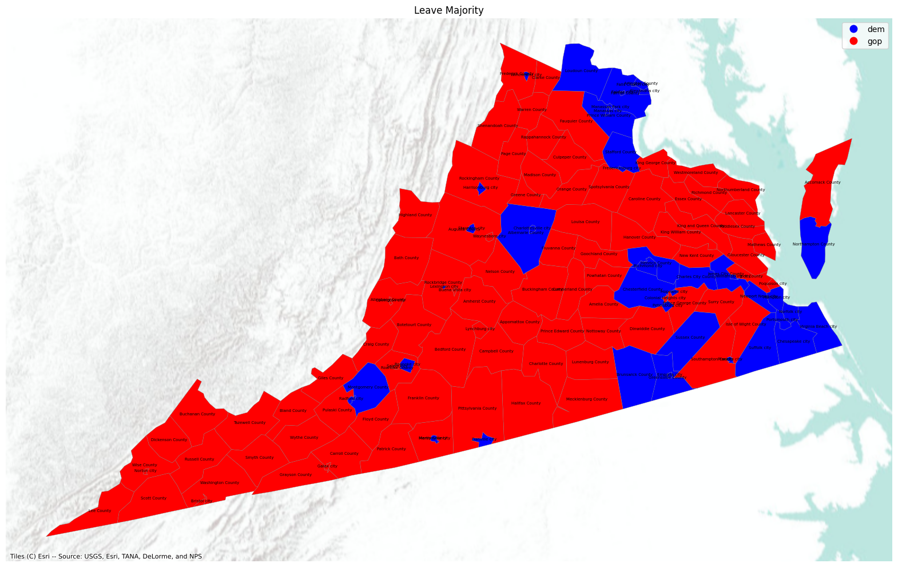

Spatial autocorrelation means that things that are close together tend to be similar. If one location has a certain value, nearby locations are likely to have similar values. It’s like how the weather in one city is often similar to the weather in a nearby city.

This is similar to regular correlation, which measures how two different things change together (like height and weight). However, spatial autocorrelation focuses on how one thing changes across different locations.

The 2024 U.S. presidential election results in Virginia exhibited spatial autocorrelation. This means that voting patterns in neighboring areas were similar, rather than randomly distributed.

For example, Kamala Harris won Virginia with 51.8% of the vote, largely due to strong support in urban and suburban areas like Northern Virginia, Richmond, and Norfolk, where she secured significant majorities. Conversely, Donald Trump dominated in rural and western parts of the state, as well as in areas like Hanover County and Virginia Beach​

This geographic clustering of political preferences aligns with the concept of spatial autocorrelation. Democratic-leaning areas, often urban and suburban, showed high voter support for Harris, while Republican-leaning rural regions strongly backed Trump. The voting pattern was not randomly dispersed but instead reflected regional demographic, economic, and social similarities​
POLITICO

Thus, Virginia's 2024 election results provide a clear example of spatial autocorrelation, where the political leaning of a given county was strongly influenced by the voting behavior of neighboring counties.

